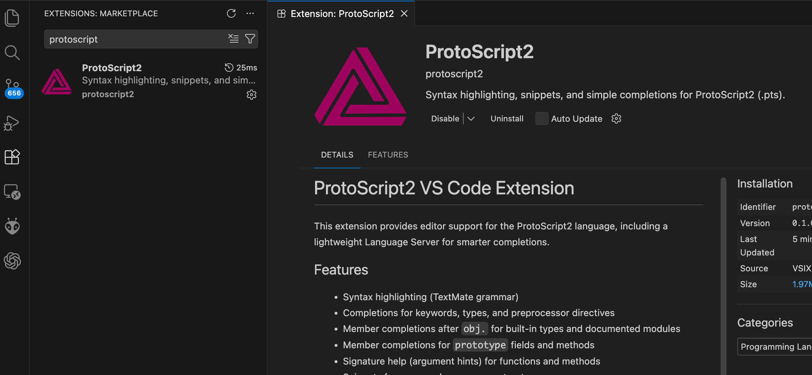

# ProtoScript V2 — Manifeste

ProtoScript V2 est un langage conçu pour une promesse simple :
**pas de magie, pas de coût caché, pas d’ambiguïté sémantique**.

ProtoScript V2 peut être qualifié de langage prototype-based statique à layout figé, dans lequel les relations de délégation, les champs et les méthodes sont entièrement déterminés à la compilation.

Article en anglais qui annonce le lancement du langage : [ProtoScript2: A Static Prototype-Based Language](https://alexandre.vialle.ovh/Articles/Programming/protoscript2-a-static-prototype-based-language)

Autre article en anglais : [ProtoScript2: At the Boundaries of Genericity](https://alexandre.vialle.ovh/Articles/Programming/protoscript2-at-the-boundaries-of-genericity)

Autre article en anglais qui pourrait être le manifeste de ProtoScript2 [Prototype-Based Thinking — The ProtoScript2 Position](https://alexandre.vialle.ovh/Articles/Programming/prototype-based-thinking-the-protoscript2-position)

Le projet est désormais spécifié, gouverné, et testable de façon indépendante.


## Ce que ProtoScript V2 assume

- typage statique strict
- modèle prototype-based (orienté objet sans classes)
- pas de RTTI utilisateur
- pas de fonctions comme valeurs
- pas de généricité de fonctions
- résolution déterministe à la compilation

## Contrat du langage

- le manuel utilisateur de référence est [`MANUEL_REFERENCE.md`](MANUEL_REFERENCE.md) (descriptif, aligné sur la spec)
- la source normative est [`SPECIFICATION.md`](SPECIFICATION.md) (ProtoScript Language Specification v2.0)
- le guide d’implémentation [`docs/implementation_guide.md`](docs/implementation_guide.md)
- la suite de conformité (`tests/manifest.json`) fait partie du contrat
- une implémentation est conforme uniquement si elle passe 100 % des tests normatifs
- aucun changement sémantique sans bump de version majeure

## Pourquoi ce dépôt existe

Ce dépôt fournit :

- une spécification normative complète
- une implémentation oracle Node.js (`bin/protoscriptc`)
- un CLI C de référence (`c/ps`) pour l’exécution
- un chemin CLI C (`c/pscc`) pour la validation frontend
- une validation croisée Node/C pour éviter les divergences silencieuses

Node.js sert de **spec exécutable**.
Le C sert de **preuve d’implémentabilité bas niveau**.

## Demo

You can test ProtoScript2 immediately thanks to a demo running on the web via WebAssembly (compiled with emscripten):

Try it now: [ppyne.github.io/ProtoScript2/](https://ppyne.github.io/ProtoScript2/)

## Commandes essentielles

### Prérequis

- Node.js (pour l’oracle `bin/protoscriptc`)
- Compilateur C (clang ou gcc) + make
- POSIX (macOS / Linux)
- `jq` (pour la suite de tests)
- [mcpp](https://github.com/zeroc-ice/mcpp) (préprocesseur intégré) récupéré via submodule Git

Récupérer les sources du préprocesseur mcpp (submodule) :

```bash
git submodule update --init --recursive
```

### Compilation

Compiler les binaires C :

```bash
make -C c
```

Cela produit :

- `c/ps` (CLI d’exécution)
- `c/pscc` (frontend C)

Vérification de conformité :

```bash
tests/run_conformance.sh
```

Validation croisée Node/C (strict) :

```bash
tests/run_node_c_crosscheck.sh --strict-ast --strict-static-c
```

Runner complet (build + conformance + crosscheck + CLI) :

```bash
tests/run_all.sh
```

Compilation/contrôle côté oracle (Node) :

```bash
bin/protoscriptc --check file.pts
bin/protoscriptc --run file.pts
bin/protoscriptc --emit-ir-json file.pts
bin/protoscriptc --emit-c file.pts
```

Notes :

- `bin/protoscriptc` (Node) est **le seul** qui produit du C (`--emit-c`) et de l’IR complet (`--emit-ir`).
- `c/pscc` (C) fournit un frontend partiel et **redirige** vers `bin/protoscriptc` pour `--emit-c` / `--emit-ir`.

Registry des modules standards :

- Le runtime/CLI charge un registry JSON pour `import Io/Math/JSON`.
- Vous pouvez forcer l’emplacement via la variable d’environnement `PS_MODULE_REGISTRY`.
Ordre de recherche par défaut :
`PS_MODULE_REGISTRY`,
`registry.json` à côté du binaire `ps`,
`./registry.json`,
`/etc/ps/registry.json`,
`/usr/local/etc/ps/registry.json`,
`/opt/local/etc/ps/registry.json`,
`./modules/registry.json`.

CLI C (exécution) :

```bash
make -C c
./c/ps --help
./c/ps run file.pts
./c/ps check file.pts
./c/ps ast file.pts
./c/ps ir file.pts
./c/ps emit-c file.pts       # forward vers bin/protoscriptc
```

Options utiles (position libres, avant ou après la commande) :

```bash
./c/ps --trace run file.pts
./c/ps run file.pts --trace-ir
./c/ps run file.pts --time
```

Frontend C (pscc) :

```bash
./c/pscc --check file.pts
./c/pscc --check-c file.pts
./c/pscc --check-c-static file.pts
./c/pscc --ast-c file.pts
./c/pscc --emit-ir-c-json file.pts
./c/pscc --emit-ir file.pts      # forward vers bin/protoscriptc
./c/pscc --emit-c file.pts       # forward vers bin/protoscriptc
```

Build WASM (reproductible) :

```bash
make web-clean
make web
```

Le pipeline WASM documenté (versions d'outils, validation parity) est ici :
[`docs/wasm-build.md`](docs/wasm-build.md)

## Extension sans compromission

ProtoScript V2 autorise des modules tiers via API native normative (section 20 de la spec) avec contraintes strictes :

- extension de l’environnement, jamais de la sémantique
- résolution compile-time uniquement
- symboles importés explicitement et typés statiquement
- aucun chargement dynamique, aucune RTTI, aucune réflexion

Documentation officielle pour écrire un module natif :
[`docs/native-modules.md`](docs/native-modules.md)

## État

ProtoScript V2 est un langage spécifié au sens de sa spécification.
La baseline v2.0 figée est taggée : `spec-v2.0-final`.

## Outils éditeur

Le dépôt inclut un support d’édition léger dans `tools/` :

- Extension VS Code (coloration, snippets, complétions et signature help via LSP minimal)
- Support Vim (détection de filetype + coloration)

Voir `tools/vscode/protoscript2/README.md` et `tools/vim/README.md` pour l’installation.


